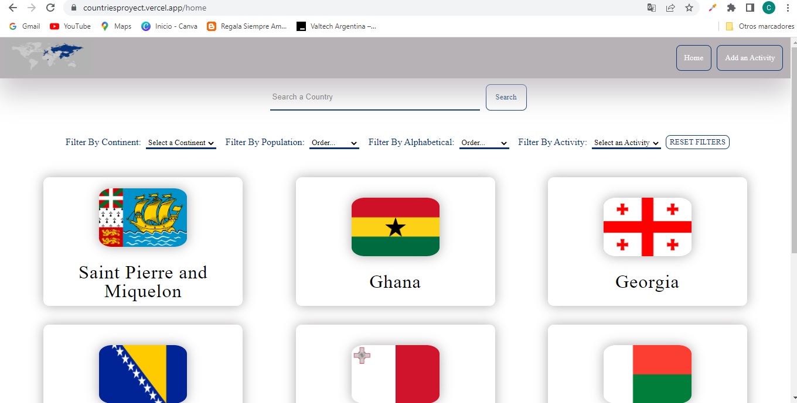

<h1 align="center">Hola, Soy Camila Castillo</h1>


<h3 align="center">Tengo 19 años y me apasiona el mundo de la tecnologia y el desarrollo. Descubrí el mundo de la programación desde mi escuela secundaria y desde entonces no deje de aprender nuevas tecnologias para poder crecer profecionalmente . Soy Full Stack Developer con orientacion hacia front-end. </h3>
<h4 align="center">Quiero compartirte mis habilidades. </h4>
<h4 align="center"> Bienvenido!! </h4>

```javascript
const aboutMe = {
   pronouns: "she" | "her",
   code: [Javascript, HTML, CSS, PHP],
   technologies: {
      frontEnd: {
         js: ["React", "Redux"],
         css: ["Bootstrap", ]
      },
      backEnd: {
         js: ["Node", "Express"]
      },
      databases: ["MySQL", "PostgreSQL"],
   },

};
```

---
### 👀 Mis Proyectos


<p>En este proyecto diseñe y desarrolle una aplicacion de paises, cuya informacion es extraida de una api externa</p>
<p>Posee: busqueda, filtros, paginano, cración de actividades y formularios controlados</p>

<h4>Home</h4>
<p>


</p>
   
<h4> ¿Queres ver todo mi proyecto?  👇 👇


[](https://github.com/CastilloCamila/PI-Countries)

 ---

<h3 align="left">Tecnologias y lenguajes:</h3>
<h3> Front-End:
<p align="left">  <a href="https://developer.mozilla.org/en-US/docs/Web/JavaScript" target="_blank"> </a>  
<a href="https://www.w3.org/html/" target="_blank"> </a>
<a href="https://www.w3schools.com/css/" target="_blank">  </a> 
<a href="https://getbootstrap.com" target="_blank">  </a> 
<a href="https://reactjs.org/" target="_blank">  </a> 
<a href="https://redux.js.org" target="_blank">  </a> </p> 
<p>JavaScript|HTML|CSS|Bootstrap|React|Redux</p>
<h3>Back-End:
<p>
<a href="https://nodejs.org" target="_blank">  </a>
<a href="https://expressjs.com" target="_blank">  </a> 
<a href="https://www.postgresql.org" target="_blank">  </a> 
<a href="https://postman.com" target="_blank"> </a> 
<a href="https://www.mysql.com/" target="_blank"> </a> 
</p>
<p> NodeJs | Express | Postgersql | Postman | MySql </p>
<h3>Otros:
<p>
<a href="https://git-scm.com/" target="_blank"> </a> 
</p>
<p>| Git |  </p>

---

<h3 align="left">Contactate conmigo:</h3>
<p align="left">
<a href="https://wa.me/+542995324123" target="_blank"></a>
   <a href="mailto:camila.castillo.manrique@gmail.com" target="_blank"></a>
   
</p>
   
---
   
   <h3 align="left">Encontrame en:</h3>
<p align="left">
<a href="https://www.linkedin.com/in/camilacastillo-fullstack-developer/" target="_blank"></a>
   
 ---
   
<p></p>


